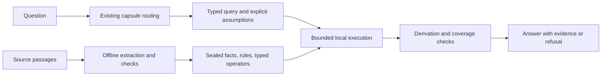

# Bounded derivation inside a capsule — research, 2026-09-13

Status: research proposal. No implementation, training, capsule mutation or new
capability certification in this task. Correctness, coverage gain and 1–5 ms
performance of the proposed path are WITHHELD until measured.

The user asks whether a capsule can combine its knowledge to answer questions
that passage selection misses. The recommendation is a small executable local
model: explicit facts, conditions, typed operations and replayable derivations.
The goal is additional correct answers on unseen combinations of supported
facts, with a 1 ms p95 target and 5 ms p99 ceiling for the warmed local path.

## What the repository establishes

The current VSA answer path scores stored passage vectors, selects top-k and
checks a best-versus-rest z floor. It returns selected passages; it does not
execute equations or prove combinations of statements. See
[src/cnet_vsa_gen_capsule.c:924](../src/cnet_vsa_gen_capsule.c#L924) and
[src/cnet_vsa_gen_capsule.c:982](../src/cnet_vsa_gen_capsule.c#L982).

A separate certified-unit mechanism already exports and imports typed units
with coverage. The composition test constructs three independently certified
numeric primitives and asks a DAG planner to compose them. Its guard checks
coverage against the executing primitive's exact input/output ports. That guard
explicitly supports one input and one output port; branching and multi-input
shapes are refused. This is a useful foundation, not evidence of arbitrary
fact conjunction or natural-language question answering. See
[guard_allow, tests/knowledge_composition_bench.c:99](../tests/knowledge_composition_bench.c#L99)
and [the test setup:229](../tests/knowledge_composition_bench.c#L229). These are
source observations; the gate was not rerun during this research task.

Schema 2 of the existing certified capsule format already carries one
manifest-bound asset and rejects unsupported asset formats. It is a possible
home for a local model, paired with an explicitly supported execution adapter;
reuse this mechanism and cnb_export_subset. The source-evidence adapter is a
narrow five-fact source-literal mechanism, not a general prose-to-facts engine.
See [include/cnet_capsule.h:73](../include/cnet_capsule.h#L73),
[export_asset:135](../include/cnet_capsule.h#L135), and
[include/cnet_capsule_evidence.h:7](../include/cnet_capsule_evidence.h#L7).

The VSA .gencap and CNU1-sealed certified unit are distinct mechanisms. Routing
to a .gencap does not confer a typed proof contract. A future bridge must bind
the routed capsule identity and evidence version to the corresponding certified
unit, refusing mismatches. MTK host-weight cartridges are not involved.

## Literature and what transfers

| Approach | What the source establishes | Proposed use and limit |
|---|---|---|
| Compiled Datalog + provenance | Soufflé provides native synthesis, typed relations and derivation trees for derived tuples. | Strong first candidate for conditional facts and short joins. Use a restricted rule subset and an offline reference engine; no requirement to embed its full compiler/runtime. [Soufflé](https://souffle-lang.github.io/docs.html), [provenance](https://souffle-lang.github.io/provenance) |
| Knowledge compilation | Darwiche and Marquis compare compiled representations by compactness and supported polynomial-time queries. | Precompute reusable rule structure and selected consequences offline. Compactness is a tradeoff: enumerating all combinations can destroy the footprint. [A Knowledge Compilation Map](https://arxiv.org/abs/1106.1819) |
| TensorLog | Logical clauses are compiled to differentiable message-passing functions; its stated complexity depends on database size and message-passing steps. | A later option for learned ranking over relational paths. A weighted path score is not a proof that an extracted premise is true. [TensorLog](https://arxiv.org/abs/1605.06523) |
| Scallop / DeepProbLog | These combine symbolic programs with uncertain or neural predicates. Scallop makes provenance and approximation choices explicit. | Keep ambiguous entity/intent candidates separate and rank bounded alternatives; avoid interpreting similarity as calibrated probability. Full probabilistic inference need not fit our budget. [Scallop provenance](https://www.scallop-lang.org/doc/probabilistic/provenance.html), [DeepProbLog](https://arxiv.org/abs/1805.10872) |
| Logic-LM | It translates natural-language problems to symbolic formulations and executes external solvers. | Adopt the separation of language interpretation from execution, but move corpus formalization offline. Its online LLM translation is not a latency solution for CNET. [Logic-LM](https://arxiv.org/abs/2305.12295) |
| ProofWriter | Iterative single-step implication generation builds proofs over natural-language rule theories, including tests of greater proof depth. | Useful inspiration for test cases and offline supervision. Its results on rule-theory tasks do not establish accuracy on our technical prose. [ProofWriter](https://arxiv.org/abs/2012.13048) |
| Neural Bellman-Ford Networks | Learned message/aggregation operators predict links from graph paths, including inductive graph settings. | Potential candidate-path proposer once reliable local relations exist. Predicted edges must not silently become certified facts. [NBFNet](https://arxiv.org/abs/2106.06935) |
| Tiny Recursive Model | A two-layer, 7M-parameter recursive model reports strong puzzle-task results. | Worth tracking as a bounded state-update model, but parameter count does not establish CPU latency, technical-language competence, or proof validity. It is not the first prototype. [TRM](https://arxiv.org/abs/2510.04871) |

None of these sources establishes end-to-end 1–5 ms CNET latency or improved
answers on our corpus. The application recommendations in this table are
engineering inferences, not findings reproduced here.

For technical domains, qualitative models are also relevant: QSIM describes
systems through constrained qualitative states and can strengthen or refute
predictions as observations arrive. The transferable idea is explicit model
assumptions, not unrestricted simulation at query time. Full model search is
outside the first experiment. [Kuipers' QSIM overview](https://web.eecs.umich.edu/~kuipers/research/qsim/qsim-overview.html)

## Recommended local model

Build one shared bounded executor; individual capsules carry compact data and
programs for their own certified domain. No separate neural model per capsule.

A retained fact needs typed arguments, units where applicable, explicit
polarity, conditions/scope and exact source spans. A rule needs explicit
premises, conclusion, applicability conditions and an allowed operation. Treat
statements containing exceptions or unresolved quantifiers as unsupported
until their semantics can be represented. A causal label on an edge does not
by itself license transitive causal claims or a counterfactual answer.

Start with three task families:

1. **Conditional deduction:** apply an explicit rule only when all premises
   and applicability conditions are established.
2. **Numeric derivation:** execute small equations or bounded numeric kernels,
   with units, domain checks, finite-value checks and explicit assumptions.
3. **Evidence conjunction:** combine two or three supporting statements with
   a registered composition rule and emit the necessary explanation together.

The first implementation should use finite, function-free rules and explicit
negative facts. A missing fact is UNKNOWN, not FALSE. Contradictory supporting
facts produce a conflict result and refusal; they do not authorize arbitrary
conclusions. These are proposed semantics requiring tests, not an assertion
that the current system already implements a four-state logic.

An execution certificate records source fact IDs, rule IDs, typed substitutions,
intermediate values and the final output. An independent checker replays the
steps and checks conditions and coverage. Soufflé's provenance mechanism is a
useful reference for recording which facts and rules produced a conclusion,
including lazy proof construction. It does not establish the truth of source
text. [Soufflé provenance](https://souffle-lang.github.io/provenance)

Render answers from verified values, source-backed clauses and small templates.
A free-form generator would add another opportunity to alter the supported
claim and another component to benchmark.

## Concrete example

Illustrative ideal ohmic model, not a claim about a current capsule's contents:

- Source-backed relation: I = V/R.
- Applicability: ohmic element, positive resistance, resistance unchanged.
- Question: if voltage doubles under those conditions, what happens to current?
- Execution: I_new/I_old = (2V/R)/(V/R) = 2 for a nonzero initial voltage.
- Answer: current doubles, under the stated fixed-resistance assumption.

The exact final sentence need not have been stored or trained as a pair. It is
a new combination of a supported operation and supplied conditions. If the
question allows resistance to change, the same conclusion is not licensed.
The response must expose the missing condition or refuse the stronger claim.

This provides a different kind of generalization from memorizing additional
question-answer pairs: recombination inside an explicitly supported domain.
It does not supply missing physical laws or unrestricted language understanding.

## The main unresolved problem is semantic fidelity

A proof can be valid for the wrong formalization. Four checks must be reported
separately: source-to-fact extraction, question-to-intent interpretation,
execution validity, and whether the final text answers the original question.
A seal binds bytes and compatibility; it does not certify that prose was
interpreted correctly or that its source is authoritative.

Offline teachers can propose facts, conditions and rules, with exact source
spans. A second model can challenge omissions and polarity, while verified
numeric tools and property tests check executable relations. Teacher agreement
is useful evidence but is not proof of semantic truth. No CNET Tier-A answers
become training targets. Verified external-tool traces may supply supervision
for a small intent parser or candidate-operation selector.

At query time, route selection alone does not identify whether the user asks
for a cause, value, comparison, condition or hypothetical change. A compact
parser must preserve roles, negation, quantities and stated assumptions. Score
its accuracy independently; unsupported or conflicting interpretations refuse.
Do not hide its cost by providing hand-written structured queries in the only
reported end-to-end benchmark.

## Keeping the model small and execution bounded

For the pilot, propose at most 256 base facts, 64 rules, proof depth four,
64 proof nodes, 4,096 rule firings and 16,384 indexed join probes per request.
Bound numeric operator work too. These are initial engineering caps, not
experimentally chosen accuracy optima. Exceeding a cap returns UNKNOWN/resource
refusal; a partial search cannot certify that an answer is false.

Pre-index predicates and compile rule dependencies offline. Cache only selected
consequences, invalidate them with the capsule's evidence/model digest, and
keep question-specific assumptions in request-local state. Avoid computing an
unbounded closure over every capsule or following unconstrained graph edges.
Soufflé documents query specialization and relation inlining, but also notes
that specialization does not always improve performance. [Soufflé relations](https://souffle-lang.github.io/relations)

Use one CPU worker and fixed scratch buffers. Measure route, parse, candidate
selection, execution, verification and rendering as one query. Retain 1 ms p95
and 5 ms p99 as targets, report observed maximum and cold load separately, and
measure CPU time at representative request rates. Operation limits bound
algorithmic work, not OS scheduling delays.

An initial asset budget of 64 KiB per pilot capsule is a proposed constraint,
including local facts, rules, indices and provenance references but reusing
existing source text. Eight pilot capsules would add at most 512 KiB of these
assets. Applying that cap to all 812 would permit about 50.75 MiB, so broad
rollout cannot be described as negligible; measure aggregate memory and only
compile useful capsules. Shared parser/executor memory must be counted too.

## Integration constraints

Extend the existing certified capsule's manifest-bound asset mechanism with an
explicitly versioned supported schema and execution adapter. Bind the model,
source evidence, operator version, parser compatibility and certification
record. Unsupported runtimes refuse. Do not add another capsule packaging
system or grant an ordinary VSA passage block certified-unit semantics.

The current single-input/single-output composition guard is insufficient for
arbitrary multi-premise joins. A local adapter must enforce all premises and
its own typed contract internally; extending public multi-input composition
requires new coverage checks and negative tests. A wider shape cannot simply
inherit the old chain gate's certification.

Preserve existing routing/refusal floors and baseline passage behavior. A
new derivation path needs its own predeclared task-specific certification;
passage z is not a confidence measure for a proof, and bypassing it without a
new certified path would not constitute a quality fix. No full registry reseal
is warranted before the pilot earns an improvement.

## Experiment that would decide whether to proceed

First audit fresh questions from eight representative capsules. Include
rule-rich domains and some rule-poor prose; report how many questions have a
single-passage answer, need a bounded combination, lack evidence, or cannot be
formalized reliably. Freeze this classification before evaluating the candidate.
That establishes an empirical opportunity ceiling rather than assuming every
refusal can be rescued.

Then compare four systems on identical questions and source evidence:

- Current passage baseline.
- Local executor given independently verified structured intents, isolating
  executor capability; explicitly report this as an oracle-input diagnostic.
- Complete local system given the original natural-language questions.
- Transformer reference given the same source evidence and answer task.

Use fresh questions and a confirmation split isolated by source material and
rule family. Hold out combinations, vary entity names and numeric values, test
longer valid chains, and keep paraphrases of the same case in one split. A
method that succeeds only on familiar question strings has not demonstrated
compositional transfer.

Counter-tests must remove a needed premise, reverse a relation, negate a fact,
change a unit, violate an operator domain, inject a contradiction, mix facts
from different capsules, mutate proof IDs and exhaust the search budget. The
checker must reject invalid derivations. Scoring includes all refusals and all
unsupported questions, not just cases with a successful proof.

Use exact tool outcomes for formal/numeric cases and independent evidence
judgments for natural-language cases; absent human labels, human-quality claims
remain WITHHELD. Report correct, wrong, refusal, correct-2*wrong, parse accuracy,
proof validity, and complete CPU latency/memory. Passing requires more correct
answers and greater net utility than the baseline without reducing any
certification floor. Replaying proofs alone is not sufficient.

Research conclusion: the strongest first bet is explicit local models with
bounded execution and evidence-backed output. Probabilistic graph learning or
recursive neural state updates can be evaluated later as proposal mechanisms.
Whether this increases CNET's real answer coverage remains an empirical question.
